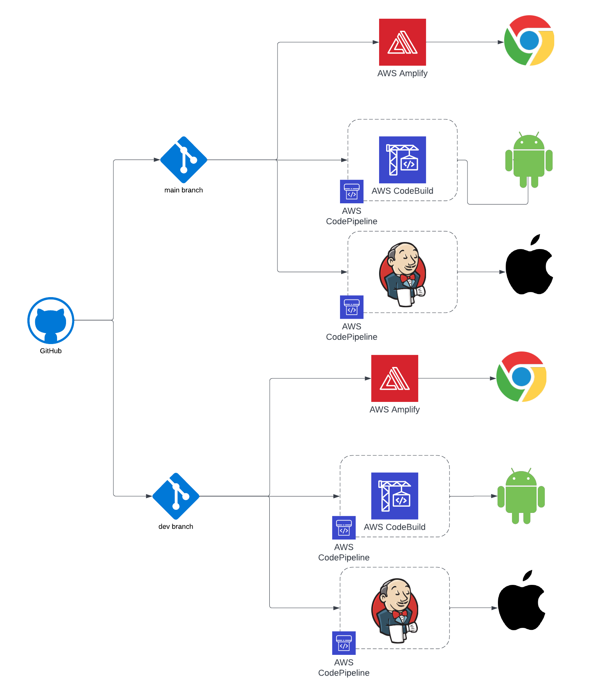
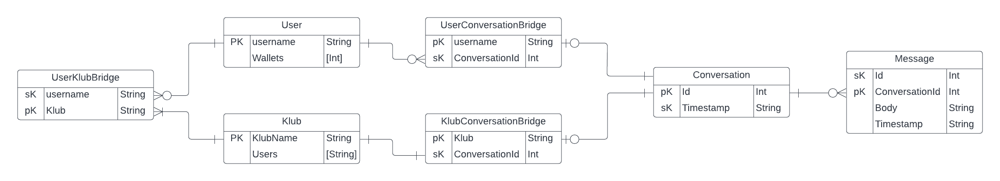

# klubby-aws-infrastructure
This repo contains the AWS infrastructure for the Klubby Application.

## Infrastructure Components
The following section goes through the major components of the AWS infrastructure.

### Back-End CICD
TODO need to add this section
### Front-End CICD

The FE-CICD infrasturcture is responsible for the deployment of the front-end of the Klubby Application on all device types. The following environments are currently supported:
- webapp dev
- webapp prod
- iOS dev
- iOS prod
- Android dev
- Android prod

A high level overview for the architecture of the Front-End CICD can be seen in the following diagram.

    

### AppSync GraphQL API

This is the main point of integration between the front end and the back end. The GraphQL API contains the following routes:

The following seection describes the schema of the GraphQL API.

##### Types
- Conversation
- Message
- MessageConnection
- User
- UserConversations
- UserConversationsConnection

##### Queries
- getAllUsers: [User]
- getUserWallets(username: String!): User
- getAllMessages(after: String, conversationId: ID!, first: Int): [Message]
- getAllMessageConnections(after: String, conversationId: ID!, first: Int): MessageConnection
- getAllMessagesFrom(after: String, conversationId: ID!, first: Int, sender: String!): [Message]
- getMe: User

##### Mutations
- createConversation(createdAt: String, id: ID!, name: String!): Conversation
- createMessage(content: String, conversationId: ID!, createdAt: String!, id: ID!): Message
- createUserConversationBridge(conversationId: ID!, username: ID!): UserConversations
- updateUser(username: String!,wallets: String!): User

##### Subscriptions
- subscribeToNewMessage(conversationId: ID!): Message
- subscribeToNewUserConversations(username:ID!): UserConversations
### DynamoDB Storage
DynamoDB is the main storage solution for managing the state of the Klubby Application. It was selected for its simplicity, scalability, and real-time capabilities. The following figure shows and Entity Relationship Diagram outlining the major data tables managing the state of the Klubby application and their relationships.

## Refrences

[AWS Blog Post - iOS GitPipeline](https://aws.amazon.com/blogs/devops/building-and-testing-ios-and-ipados-apps-with-aws-devops-and-mobile-services/)

[Deploying Capacitor iOS App](https://www.joshmorony.com/deploying-capacitor-applications-to-ios-development-distribution/#do-i-need-a-mac-to-deploy-to-ios)

[Pushing CodePipeline Status to Github](https://aws.amazon.com/blogs/devops/aws-codepipeline-build-status-in-a-third-party-git-repository/)

[AWS Blog Post - Android GitPipeline](https://aws.amazon.com/blogs/mobile/build-a-cicd-pipeline-for-your-android-app-with-aws-services/)

[Example Android CICD Docker Image](https://github.com/javiersantos/android-ci)